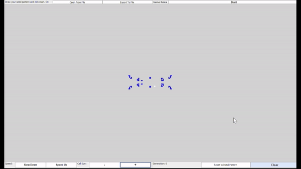
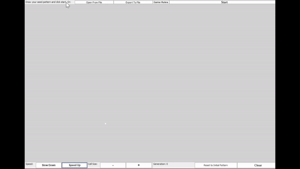

*******************************************************************************************
# Game Of Life Program.
*******************************************************************************************

### GAME OF LIFE RULES:   
The universe of the Game of Life is an infinite, two-dimensional orthogonal grid of square cells, each of which is in one of two possible states, live or dead (or populated and unpopulated, respectively).
Every cell interacts with its eight neighbors, which are the cells that horizontally, vertically, or diagonally adjacent. At each step in time, the following transition occur:
1) Any live cell with fewer than two live neighbors dies, as if by underpopulation. 
2) Any live cell with two or three live neighbors lives on to the next generation. 
3) Any live cell with more than three live neighbors dies, as if by overpopulation. 
4) Any dead cell with exactly three live neighbors becomes a live cell, as if by reproduction. 

 

    
    

        
 

### Implemented Command:
- Left mouse click --> Select / Make Cell Alive 
- Right mouse click --> Erase / Kill Cell
- Ctrl + Right mouse click + Drag --> Select Multiple Cell
- Ctrl + C or X (After Multiple Cell Selection) --> Copy / Cut Selected Cells
- Ctrl + V --> Paste Selected Cells

For more Patterns to upload:
- http://www.radicaleye.com/lifepage/picgloss/picgloss.html
- https://conwaylife.appspot.com/pattern/almosymmetric

